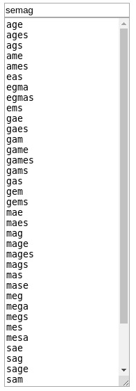

#### Screenshots

#### About

Word Games is a small utility that lists possible matches from a dictionary of words, for a given group of letters.

This can be used to assist you in completing word games, such as the mobile game Wordscapes.

#### Setup

1. Open `index.html` in a browser.

#### Use

1. Enter the given letters in the textbox.
2. See the list of possible words that can be created with the letters.

